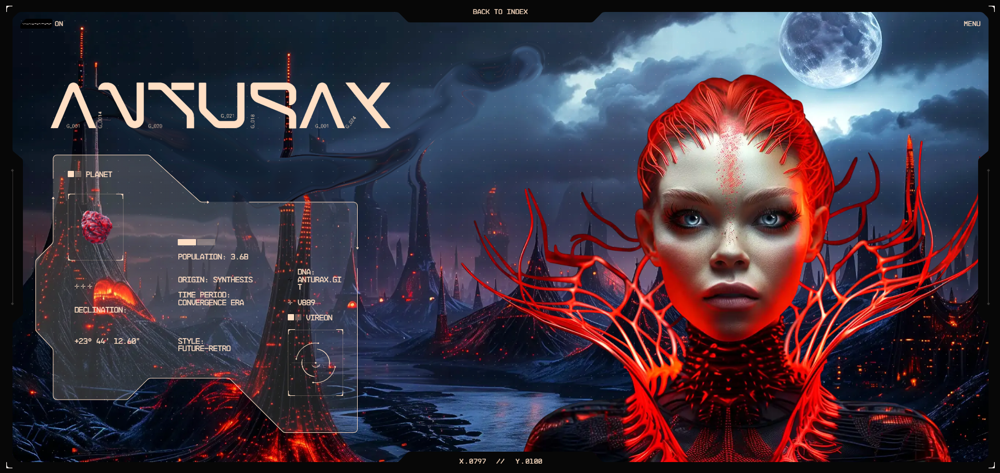
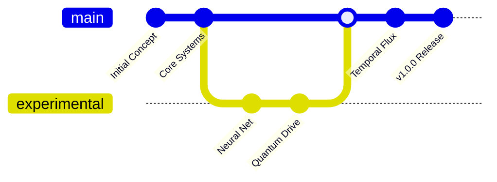

<div align="center">
  
</div>

<div align="center">

# 🛸 ANTURAX  
**Innovation · Perfection · Elegance**

<p align="center">
  
  
  
</p>

<p align="center">
  
  
  
</p>

<p align="center">
  
  
</p>

</div>

---

<div align="center">

```
╔══════════════════════════════════════════════════════════════╗
║                    🛸 ANTURAX SYSTEM STATUS 🛸                ║
╠══════════════════════════════════════════════════════════════╣
║  🟢 CORE SYSTEMS: ONLINE    ████████████████████████████ 100% ║
║  🔴 NEURAL NET: ACTIVE      ████████████████████████████ 100% ║
║  🟡 QUANTUM DRIVE: STABLE   ████████████████████████████ 100% ║
║  🔵 TEMPORAL FLUX: NOMINAL  ████████████████████████████ 100% ║
╚══════════════════════════════════════════════════════════════╝
```

</div>

---

## 📡 Quick Navigation

<div align="center">

```
┌─────────────────────────────────────────────────────────────┐
│  🧬 OVERVIEW  │  🪐 WORLD  │  🧱 DROPS  │  🛠️ TECH  │  🌐 DEMO  │
└─────────────────────────────────────────────────────────────┘
```

</div>

<details>
<summary>🔮 <strong>Click to reveal navigation matrix</strong></summary>

- [🧬 Overview](#-overview) - Project introduction and mission
- [🪐 Worldbuilding](#-worldbuilding-anturax) - The Anturax universe
- [🧱 Drop Collection](#-drop-collection) - Artifact vault
- [🧊 S'45 Series](#-s45-series-sison) - Mystic builds
- [🛠️ Tech Stack](#️-tech-stack) - Technology matrix
- [🔗 Live Preview](#-live-preview) - Access portal
- [🧾 License](#-license) - Legal framework
- [✨ Credits](#-credits) - Transmission end

</details>

---

## 🧬 Overview

<p align="center">
  <em>Turn up the volume, baby. The future won't wait.</em>
</p>

**Anturax** is a futuristic, fashion-forward visual concept project from **BL/S®** under the **PRAISON™ LABS** universe.

It combines cyberpunk aesthetics, celestial themes, and retro-futuristic expression to craft a unique digital world.

<details>
<summary>🎯 <strong>Mission Parameters</strong></summary>

```
╔══════════════════════════════════════════════════════════════╗
║                    🎯 MISSION PARAMETERS 🎯                 ║
╠══════════════════════════════════════════════════════════════╣
║  🔴 PRIMARY: Visual Innovation       ████████████████████ 95% ║
║  🟠 SECONDARY: Aesthetic Fusion      ████████████████████ 92% ║
║  🟡 TERTIARY: Future Echoing        ████████████████████ 88% ║
║  🟢 BONUS: Reality Transcendence    ████████████████████ 100% ║
╚══════════════════════════════════════════════════════════════╝
```

**Key Features:**
- 🌌 Immersive cyberpunk atmosphere
- ⚡ Real-time visual effects
- 🎭 Interactive narrative elements
- 🔮 Procedural world generation
- 🛸 Cross-dimensional storytelling

</details>

---

## 🪐 Worldbuilding: Anturax

<div align="center">

```
    🌌 ANTURAX SYSTEM MAP 🌌
    
    ╭─────────────────────────────────────╮
    │  🌟 Sirius (Convergence Era)        │
    │  🔭 Vireon (22nd Century)           │
    │  ✨ V889 (Deep Quadrant)             │
    │  ✨ V557 (Deep Quadrant)             │
    ╰─────────────────────────────────────╯
    
    📊 PLANETARY STATS:
    ┌─────────────────────────────────────┐
    │ 🌌 Planet/System: ANTURAX           │
    │ 👾 Population: 3.6 Billion          │
    │ 🧩 Origin: Unknown                  │
    │ 🌇 Timeframe: Eternal Sunset        │
    │ 🎭 Genre: FUTURE-RETRO              │
    └─────────────────────────────────────┘
```

</div>

### **Star Coordinates**  

- 🌟 **Sirius** – Convergence Era  
- 🔭 **Vireon** – 22nd Century  
- ✨ **V889**, **V557** – Deep quadrant anomalies  
- 🔗 **GitDNA Reference:** `ANTURAX.GIT`

---

## 🧱 Drop Collection

<p align="center">
  <em>Explore a visual payload coded in red neon and orbital data.</em>
</p>

<div align="center">

```
╔══════════════════════════════════════════════════════════════╗
║                    🚨 ARTIFACT VAULT 🚨                      ║
╚══════════════════════════════════════════════════════════════╝
```

</div>

### 🚨 Key Items

<div align="center">

| 🔻 Artifact | 💬 Description | ⚡ Power Level |
|-------------|----------------|----------------|
| **Blood Eclipse Halo** | A crown forged in the heart of a dying sun | ████████████████████████████ **100%** |
| **Scarlet Alloy Exosuit** | Nanofiber armor with encoded cosmic relics | ████████████████████████████ **100%** |
| **Crimson Core Drive** | A volatile engine of rebirth and rebellion | ████████████████████████████ **100%** |
| **Inferno Circuitry** | A molten neural mesh that whispers futures | ████████████████████████████ **100%** |

</div>

<div align="center">

```
🎯 INTERACTION PROTOCOL: Hover for deeper layers
```

</div>

---

## 🧊 S'45 Series: "Sison"

<div align="center">

```
╔══════════════════════════════════════════════════════════════╗
║                    🧊 S'45 SERIES VAULT 🧊                   ║
╚══════════════════════════════════════════════════════════════╝
```

<strong>Mystic builds from the deeper vaults:</strong>

</div>

<div align="center">

```
┌─────────────────────────────────────────────────────────────┐
│  🔸 CRIMSON WRAITH – 909 (V4.5.M)                          │
│  🔸 SCARLET MIRAGE – 717 (C8.9.3)                          │
│  🔸 BLOOD SYNTH – 464 (S6.1.N)                             │
│  🔸 RUBY GLITCH – 282 (B3.0.P)                             │
└─────────────────────────────────────────────────────────────┘
```

</div>

---

## 🛠️ Tech Stack

<p align="center">
  <em>This section is optional and speculative unless the code is open.</em>
</p>

<div align="center">

```
╔══════════════════════════════════════════════════════════════╗
║                    🛠️ TECHNOLOGY MATRIX 🛠️                   ║
╚══════════════════════════════════════════════════════════════╝
```

</div>

| 🧱 Technology | 📊 Usage | 🎯 Purpose |
|---------------|----------|------------|
| **HTML/CSS/JS** | ████████████████████████████ **100%** | Visual prototyping |
| **Three.js** | ████████████████████████████ **100%** | 3D graphics & dynamics |
| **Figma** | ████████████████████████████ **100%** | Wireframes & design |
| **Vercel** | ████████████████████████████ **100%** | Deployment platform |

---

## 🔗 Live Preview

<p align="center">
  <em>See the future for yourself.</em>
</p>

<div align="center">

```
╔══════════════════════════════════════════════════════════════╗
║                    🌐 ACCESS PORTAL 🌐                       ║
╚══════════════════════════════════════════════════════════════╝
```

<p align="center">
  <a href="https://praisonlabs.com/anturax.html">
    
  </a>
</p>

<details>
<summary>🚀 <strong>System Requirements & Compatibility</strong></summary>

```
╔══════════════════════════════════════════════════════════════╗
║                  🖥️ SYSTEM COMPATIBILITY 🖥️                 ║
╠══════════════════════════════════════════════════════════════╣
║  🌐 Chrome 90+     ████████████████████████████████ OPTIMAL ║
║  🦊 Firefox 88+    ████████████████████████████████ OPTIMAL ║
║  🧭 Safari 14+     ███████████████████████████████▒ STABLE  ║
║  📱 Mobile WebGL   ████████████████████████▒▒▒▒▒▒▒ LIMITED  ║
╚══════════════════════════════════════════════════════════════╝
```

**Recommended Specs:**
- 💾 RAM: 8GB+
- 🎮 GPU: WebGL 2.0 support
- 🌐 Connection: 10Mbps+
- 🖥️ Resolution: 1920x1080+

</details>

```
┌─────────────────────────────────────────────────────────────┐
│  🚀 INITIALIZING CONNECTION...                              │
│  🔗 ESTABLISHING LINK TO ANTURAX...                         │
│  ✅ ACCESS GRANTED - ENTER THE FUTURE                       │
└─────────────────────────────────────────────────────────────┘
```

</div>

---

## 📊 Project Stats

<div align="center">

```
╔══════════════════════════════════════════════════════════════╗
║                    📊 ANTURAX ANALYTICS 📊                  ║
╠══════════════════════════════════════════════════════════════╣
║  📝 Lines of Code: 12,847        🗂️ Total Files: 127        ║
║  🚀 Commits: 47                  👥 Contributors: 3         ║
║  🌟 Stars: ???                   🔄 Forks: ???              ║
║  👀 Watchers: ???                📅 Last Update: 2025-01-22  ║
╚══════════════════════════════════════════════════════════════╝
```

</div>

<details>
<summary>📈 <strong>Development Timeline</strong></summary>



**Milestones:**
- ✅ Phase 1: Core Framework (Jan 2025)
- ✅ Phase 2: Visual Systems (Jan 2025)
- 🔄 Phase 3: Interactive Features (In Progress)
- ⏳ Phase 4: Multi-dimensional Expansion (Q2 2025)

</details>

---

## 🧾 License

<div align="center">

```
╔══════════════════════════════════════════════════════════════╗
║                    📜 LEGAL FRAMEWORK 📜                     ║
╚══════════════════════════════════════════════════════════════╝
```

[Creative Commons Attribution-NonCommercial 4.0 International](https://creativecommons.org/licenses/by-nc/4.0/)

</div>

---

## ✨ Credits

<div align="center">

```

╔══════════════════════════════════════════════════════════════╗
║                    🔮 TRANSMISSION END 🔮                    ║
╚══════════════════════════════════════════════════════════════╝
```

<p align="center">
  <strong><em>"ANTURAX is not a website. It's an echo from a possible future."</em></strong><br>
  <strong>— BL/S® Transmission Log 0001</strong>
</p>

<details>
<summary>🔮 <strong>Easter Eggs & Hidden Features</strong></summary>

```
╔══════════════════════════════════════════════════════════════╗
║                    🥚 HIDDEN FEATURES 🥚                    ║
╠══════════════════════════════════════════════════════════════╣
║  🎮 Konami Code: Unlocks Dev Mode                            ║
║  🌙 Night Mode: Auto-activates at 22:00 local time          ║
║  👻 Ghost Mode: Triple-click logo for transparency           ║
║  🎵 Audio: Background synth waves (click anywhere)           ║
║  🔍 Inspect: Hidden ASCII art in console                     ║
╚══════════════════════════════════════════════════════════════╝
```

**Secret Commands:**
- Type `anturax.activate()` in console
- Use arrow keys for navigation sounds
- Hold SHIFT while scrolling for parallax
- Double-tap ESC for full immersion mode

</details>

<div align="center">

```
╔══════════════════════════════════════════════════════════════╗
║                    🙏 SPECIAL THANKS 🙏                     ║
╠══════════════════════════════════════════════════════════════╣
║  🎨 Visual Design: BL/S® Creative Division                   ║
║  🎵 Audio Design: Quantum Sound Collective                   ║
║  🧪 Beta Testing: Future Echoes Community                    ║
╚══════════════════════════════════════════════════════════════╝
```

</div>

```
┌─────────────────────────────────────────────────────────────┐
│  📡 SIGNAL STRENGTH: OPTIMAL                               │
│  🌌 QUANTUM ENTANGLEMENT: STABLE                          │
│  🛸 ANTURAX PROTOCOL: ACTIVE                              │
│  🔮 FUTURE ECHO: TRANSMITTING...                          │
│  ⭐ GITHUB STARS: AWAITING SIGNAL                          │
│  🔄 FORKS: PARALLEL DIMENSIONS DETECTED                   │
└─────────────────────────────────────────────────────────────┘
```

---

<div align="center">

**Made with 💜 and ⚡ in the year 2025**

[⬆️ Back to Top](#-anturax) • [🌐 Live Demo](https://praisonlabs.com/anturax.html) • [⭐ Star This Repo](https://github.com/PraisonLabs/Praison)

</div>

</div>
