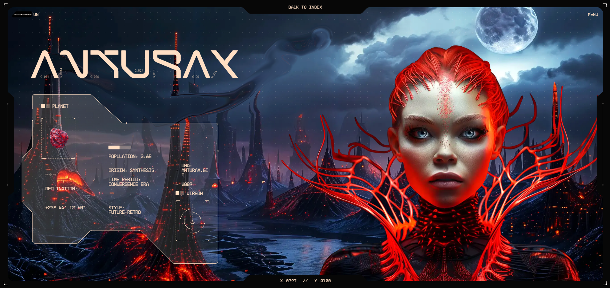

<p align="center">
  
</p>

<h1 align="center">🛡️ Anturax</h1>
<p align="center"><strong>Cybersecurity Sandbox & Threat Intelligence Dashboard</strong></p>

<p align="center">
  <a href="https://github.com/yourusername/anturax/stargazers"></a>
  <a href="https://github.com/yourusername/anturax/blob/main/LICENSE"></a>
  <a href="https://github.com/yourusername/anturax/issues"></a>
</p>

---

## 🔍 Overview

**Anturax** is a simulated cybersecurity environment designed for analyzing threats, monitoring suspicious behaviors, and training security workflows — all in a safe, educational sandbox. It mimics real-world systems without the risk of executing real malware.

---

## 🌐 Project Showcase

Explore the official **Anturax** project showcase, a futuristic and immersive web experience that captures the project's aesthetic and lore.

**[Visit the Anturax Website](https://p-dich.vercel.app/anturax.html)**

<p align="center">
  <a href="https://p-dich.vercel.app/anturax.html">
    
  </a>
</p>

> Drenched in crimson, pulsing with neon-red rebellion... a pulsating web of molten data, rewriting the fabric of reality.

This award-winning site by [Serhii Polyvanyi](https://p-dich.vercel.app/anturax.html) provides the thematic backdrop for the Anturax cybersecurity simulator.

---

## 🧩 Features

- 🧪 Simulated malware sandbox (no actual threats)
- 📡 Threat detection logs with mock telemetry
- 🌐 Heatmap dashboard for real-time attack surface visualization
- 🚨 Process anomaly scoring system
- 🛑 Simulated firewall & packet tracing modules

---

## 🛠️ Tech Stack

| Layer        | Technologies              |
|--------------|---------------------------|
| Frontend     | React, Tailwind CSS       |
| Backend      | Node.js, Express          |
| Visualization| Chart.js, D3.js           |
| Simulation   | Mock Sysmon, JSON feeds   |

---

## 📁 Directory Structure

```bash
anturax/
├── src/
│   ├── backend/          # Express API (mock)
│   ├── frontend/         # React dashboard
│   └── simulator/        # Fake telemetry/data stream
├── assets/               # Screenshots & demo assets
├── .env.example
├── README.md
├── LICENSE
└── package.json
```

---

## 🚀 Quick Start

```bash
git clone https://github.com/yourusername/anturax.git
cd anturax
npm install
cp .env.example .env
npm run dev
```

---

## 📸 Screenshots

| Threat Overview                                                                   | Packet Monitor                                                                        |
| --------------------------------------------------------------------------------- | ------------------------------------------------------------------------------------- |
|  |  |

---

## 🧪 Test Simulated Attack

```bash
npm run simulate:attack
```

---

## 📄 License

Licensed under the [MIT License](./LICENSE)

---

## 🙋 About

Made by [@yourusername](https://github.com/yourusername)
For educational demos, portfolios, and fun. Not for actual deployment.

> *Anturax is where threats are studied, not spread.*
